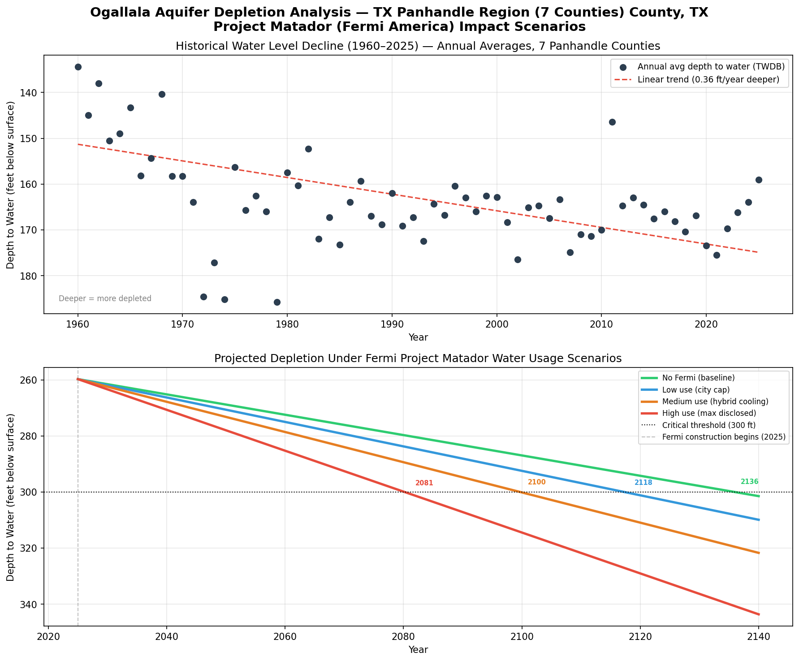

# Ogallala Aquifer Depletion Forecaster
### Analyzing the water impact of Fermi America's Project Matador on the Texas Panhandle

---

## What This Project Does

Fermi America is currently constructing Project Matador, billed as the world's largest AI data center campus, on 7,570 acres in Carson County, Texas, adjacent to the Pantex nuclear plant near Amarillo. The facility has disclosed water usage of up to 27.5 million gallons per day drawn from the Ogallala Aquifer, the sole freshwater source for the Texas Panhandle.

This project builds a scenario-based depletion model using 3,630 real well measurements from the Texas Water Development Board (TWDB) across seven Panhandle counties. It projects when the aquifer reaches a critical pumping threshold under four water usage scenarios with and without Fermi's disclosed water draw.

---

## Key Finding

| Scenario | Fermi Daily Usage | Critical Threshold Year |
|---|---|---|
| No Fermi (baseline trend) | 0 MGD | 2136 |
| Low use (city agreement cap) | 5.5 MGD | 2118 |
| Medium use (hybrid cooling) | 13.2 MGD | 2100 |
| **High use (max disclosed)** | **27.5 MGD** | **2081** |

**Fermi's maximum disclosed water usage accelerates aquifer depletion by approximately 55 years** compared to the baseline trend, from 2136 to 2081.

---

## Chart



---

## Data Sources

- **TWDB Groundwater Database** — 3,630 static water level measurements (ObsCodes M, S, L, C) from Carson, Potter, Randall, Deaf Smith, Moore, Oldham, and Hartley counties
  - URL: https://www3.twdb.texas.gov/apps/reports/GWDB/WaterLevelsByAquifer
- **Fermi America city council filings** — water usage figures disclosed at Amarillo City Council meetings, October 2025 (public record)
- **USGS Scientific Investigations Report 2022-5026** — used to validate 
  realistic depth ranges for Ogallala monitoring wells in Carson County, 
  TX Panhandle. Informed filtering parameters.
- **Scanlon et al. (2012)** — *Groundwater depletion and sustainability of irrigation in the US High Plains*, PNAS. Used for critical threshold definition.

---

## Methodology

1. Downloaded water level data from TWDB GWDB for 7 Panhandle counties
2. Filtered to static measurements only (ObsCodes M/S/L/C) to exclude pump-affected readings
3. Filtered to 50–260 ft depth range to isolate Ogallala Formation wells
4. Averaged readings by year to reduce noise
5. Fit a linear regression to calculate historical decline rate (0.36 ft/year)
6. Converted Fermi's disclosed gallons/day to equivalent aquifer depth impact using:
   - Carson County area: 560,000 acres
   - Ogallala specific yield: 15% (standard USGS value)
7. Projected depletion from 2025–2120 under four scenarios
8. Identified year each scenario crosses 300 ft critical threshold

### Limitations
- Linear model assumes constant decline rate, actual depletion may accelerate as saturated thickness decreases
- Regional average across 7 counties smooths local variation around the Fermi site
- Fermi's actual water usage is not yet known, model uses publicly disclosed estimates only
- Does not account for potential changes in agricultural pumping or climate

---

## How to Run

**Requirements:**
- Python 3.x
- matplotlib

**Install dependencies:**
```bash
pip3 install matplotlib
```

**Run:**
```bash
python3 datacenter.py
```

**Expected output:**
- Summary table printed to terminal
- `ogallala_forecast.png` saved to project folder

---

## Author

Research project exploring the intersection of AI infrastructure and water resource sustainability in the Texas Panhandle. Built by David Schneider.

*Data current as of April 2026. Fermi Project Matador is actively under construction.*